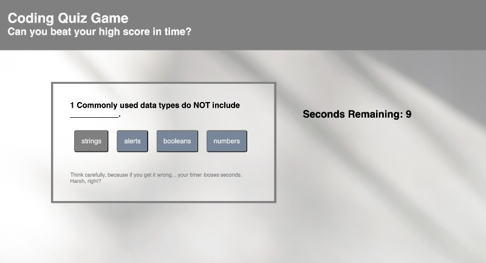

# code-quiz
Timed Quiz Game with Coding Questions


#### Jump to: 
* [Description](#description)
* [Link](#link)
* [Methods](#methods)
* [Author](#author)


## Description

On this page, play a Javascript-powered interactive coding quiz game. Each question is multiple choice. After you make your guess, you'll see if you got the last guestion right or wrong, the next question will appear, your score will update. If you get a question wrong, the timer will lose time - yikes! When you answer all the questions or the timer runs out is when the game is over. Once the game is over, you can record your scores and choose to play again.

<br><br>



<br><br>


## Link

[Live Code Quiz](https://laurendarrimon.github.io/code-quiz/)


## Built With

* [Javascript](https://www.w3schools.com/js/)
* [HTML](https://www.w3schools.com/html/default.asp)
* [CSS](https://www.w3schools.com/w3css/defaulT.asp)


## Methods 

### Javascript

This code quiz utilizes extensive web APIs to dynamically generate the interactive quiz from Javascript, rather than from hard coded HTML or CSS. These web APIs use javascript to interact with the document object model, or the DOM. The javascript finds elements, changes them, and adds new elements, based on what's needed for the game. 

For example, in the following code snippet, rather than having a set of several buttons written into the HTML for each question, this for loop creates a fresh button for each answer choice from an array of questions answers and then appends each button to the DOM. 

```
for (let i = 0; i < codeQuiz.questionsAndAnswers.length - 1; i++ ){
            
     let answerButton = document.createElement("BUTTON");  
    answerButton.innerHTML = codeQuiz.questionsAndAnswers[questionNumber-1].options[i];                   
    answerSection.appendChild(answerButton);

    answerButton.addEventListener("click", checkAnswer);
};
```


## Author

### Lauren Duker Darrimon 

- [Link to Portfolio Site](https://www.laurenlalita.com)
- [Link to Github](https://github.com/LaurenDarrimon)
- [Link to LinkedIn](https://www.linkedin.com/in/lauren-lalita-duker-9537b1201/)